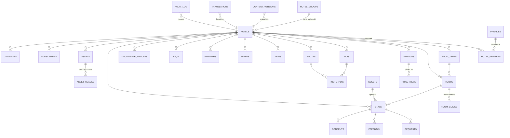

# AI OLLY Platform 2.0 — Database Architecture Proposal (v0, for review)

> **Proposal only — no SQL, no tables, no migration applied.** Built on the locked decisions in `AI_OLLY_PLATFORM_DECISIONS.md` (1–30 + A–J). Table/column names are *proposed* and may change in review.
> Nothing here touches production, Airtable, or the guest PWA. `DATA_PROVIDER` stays `airtable`.
> Date: 2026-08-01. Branch `feature/ai-olly-platform-2`.

## Conventions (proposed)
- `snake_case`, plural table names, **UUID** primary keys (`gen_random_uuid()` via pgcrypto — already enabled in the foundation migration).
- Every business table carries: `hotel_id` (tenant key; **nullable** only on *inheritable* content = platform default), audit fields `created_at`, `updated_at`, `created_by`, `updated_by`, and soft delete `deleted_at`.
- `updated_at` maintained by the existing `platform.set_updated_at()` trigger helper.
- **RLS ON by default** on every table; fail-closed (no policy ⇒ no access).
- Inheritable content uses a stable **`key`** (slug) so a hotel row can override a platform default with the same key.
- Enums as Postgres enum types (roles, statuses, sources).

---

## 1. Proposed domain model (bounded contexts)

| # | Context | Responsibility |
|---|---|---|
| 1 | **Tenancy & Identity** | hotel groups, hotels, staff users, memberships, roles |
| 2 | **Rooms** | room types, rooms (with backward-compatible access tokens), room guide content |
| 3 | **Operational Content** | services, POIs, routes, partners, events, news, whispers, FAQ (draft→publish→version, inheritable) |
| 4 | **Pricing** | generic `price_items` linked to services/other contexts, PMS-ready |
| 5 | **AI Knowledge** | knowledge articles (platform + hotel override), AI config/persona, response + unanswered logs, embeddings-ready |
| 6 | **Guests, Stays & Consent** | stays (manual/QR/PMS), guests (no accounts), consents (legal) |
| 7 | **Reception** | requests, feedback, push subscriptions |
| 8 | **Media / Assets** | Supabase Storage objects + metadata + usage tracking |
| 9 | **Newsletter** | subscribers, segments, campaigns, stats (Brevo delivery) |
| 10 | **Cross-cutting** | Localization, Versioning/Publishing, Audit & Retention (apply across contexts 3–9) |

Design pillars: **typed domain tables** (clear, queryable) + **three shared cross-cutting mechanisms** (translations, versioning, audit) so we don't repeat i18n/version columns on every table.

---

## 2. Entity-relationship overview

*Cross-cutting tables (`translations`, `content_versions`, `audit_log`, `retention_policies`) attach polymorphically to the content tables via `(entity_type, entity_id)` rather than hard FKs, so one mechanism serves every content type.*

---

## 3. Table inventory (proposed)

Flags: **T** = tenant-scoped (`hotel_id`) · **I** = inheritable (platform default + hotel override) · **L** = has translatable fields · **V** = versioned/publishable · **A** = audited.

### Tenancy & Identity
| Table | Purpose | Key columns | Flags |
|---|---|---|---|
| `hotel_groups` | brand/group owning hotels | id, name, slug, status | A |
| `hotels` | a hotel (tenant) | id, group_id?, slug (unique, **backward-compat**), name, timezone, phone, mobile, address, email, check_in, check_out, status | A |
| `profiles` | app metadata for `auth.users` | user_id (pk→auth.users), display_name, **is_platform_admin** | A |
| `hotel_members` | staff ↔ hotel membership + role | id, hotel_id, user_id, **role** (enum), status, invited_by | A |

Roles enum (hotel-scoped): `hotel_admin`, `reception`, `editor`, `marketing`, `read_only`. **Platform-wide** access = `profiles.is_platform_admin` (cross-hotel).

### Rooms
| Table | Purpose | Key columns | Flags |
|---|---|---|---|
| `room_types` | room categories (was SOBE) | id, hotel_id, key, name, view, capacity | T L V A |
| `rooms` | physical rooms | id, hotel_id, number, room_type_id, **access_token** (unique per hotel — **frozen QR compat**), status | T A |
| `room_guides` | per-room operational content | id, hotel_id, room_id, wifi, ac, tv, safe, smart_glass, features, notes, ai_welcome | T L V A |

### Operational Content (all: T I L V A unless noted)
| Table | Purpose | Notable columns |
|---|---|---|
| `services` | hotel services | id, hotel_id?, key, category, is_critical |
| `pois` | points of interest | id, hotel_id?, key, category, latitude, longitude *(frozen — not changed)*, always_on, sort_order |
| `routes` | walking routes | id, hotel_id?, key, type, duration |
| `route_pois` | route ↔ POI ordering | route_id, poi_id, position *(join; not versioned itself)* |
| `partners` | concierge partners | id, hotel_id?, key, cuisine, price, atmosphere |
| `events` | hotel + city events | id, hotel_id?, key, start_date, end_date, kind |
| `news` | dynamic news (NOVOSTI) | id, hotel_id, key, publish_at, expire_at, push_on_publish |
| `faqs` | first-class FAQ | id, hotel_id?, key, category |
| `whispers` | cultural series | id, hotel_id?, key, chapter_no *(likely platform-shared — see §8)* |

### Pricing
| Table | Purpose | Key columns |
|---|---|---|
| `price_items` | generic prices (E) | id, hotel_id?, context_type, context_id, amount, currency, vat_included, tax_rate, billing_unit, valid_from, valid_to, status, note, **external_source, external_id, last_synced_at** (PMS-ready) |

### AI Knowledge
| Table | Purpose | Key columns | Flags |
|---|---|---|---|
| `knowledge_articles` | redesigned AI knowledge (replaces 617 intents) | id, hotel_id?, key, category, tags, is_critical | T I L V A |
| `ai_configs` | per-hotel persona/output rules | id, hotel_id?, persona_voice, output_rules, disambiguation, fallback | T I L A |
| `ai_response_logs` | every AI answer | id, hotel_id, room, question, answer, intent, deterministic, safe_handoff, latency_ms, created_at | T (90-day retention) |
| `unanswered_questions` | safe-handoff captures | id, hotel_id, question, detected_intent, status | T |
| `knowledge_embeddings` | **placeholder (future/Phase 9)** — pgvector, not created now | (deferred) | — |

*Deterministic handlers stay in code (safety layer, decision 18); `ai_configs` holds only per-hotel prompt configuration.*

### Guests, Stays & Consent
| Table | Purpose | Key columns | Flags |
|---|---|---|---|
| `guests` | guest master (no account) | id, hotel_id, name?, email?, phone?, country, **pseudonymized** | T A |
| `stays` | a stay | id, hotel_id, room_id, guest_id?, **stay_token** (unique), source (manual/qr/pms), check_in, check_out, status | T A |
| `requests` | reception requests | id, hotel_id, stay_id?, room, category, message, priority, status, assignee, note, notification_status | T A |
| `feedback` | post-checkout feedback | id, hotel_id, stay_id?, overall, room, staff, location, cleanliness, comment | T A |
| `consents` | GDPR consent (legal) | id, hotel_id, guest_id?/stay_id?, gdpr, marketing, newsletter, signature_asset_id, consent_pdf_asset_id, signed_at, retention_policy_id | T A (retained per policy) |
| `push_subscriptions` | web-push subs | id, hotel_id, room/stay, subscription, active | T |

### Media / Assets
| Table | Purpose | Key columns | Flags |
|---|---|---|---|
| `assets` | Storage object metadata | id, hotel_id, bucket, path, kind (image/pdf/audio/video/signature/logo), mime, size_bytes, alt_text, rights_source, uploaded_by | T A |
| `asset_usages` | where an asset is used | id, asset_id, entity_type, entity_id, field | T |

Buckets: `media-public` (guest media), `consent-private` (signatures + consent PDFs, signed-URL only), `documents`. Upload limits per H. Image-optimization pipeline planned (§8).

### Newsletter
| Table | Purpose | Key columns |
|---|---|---|
| `subscribers` | newsletter contacts | id, hotel_id, email, locale, consent_source, status, brevo_contact_id |
| `segments` | audience segments | id, hotel_id, name, definition (jsonb) |
| `campaigns` | campaigns | id, hotel_id, name, template_ref, segment_id, status, brevo_campaign_id, scheduled_at, sent_at |
| `campaign_stats` | mirrored Brevo stats | campaign_id, sends, opens, clicks, bounces, unsubscribes, synced_at |

### Cross-cutting
| Table | Purpose | Key columns |
|---|---|---|
| `translations` | all localized text (F) | id, hotel_id?, entity_type, entity_id, field_key, locale, value |
| `content_versions` | version history + publish snapshots (D, I) | id, hotel_id?, entity_type, entity_id, version_no, status (draft/published/archived), snapshot (jsonb), translations_snapshot (jsonb), is_critical, created_by, created_at, published_at, published_by |
| `audit_log` | who/when/before→after | id, hotel_id?, actor_user_id, action, entity_type, entity_id, before (jsonb), after (jsonb), created_at |
| `retention_policies` | configurable retention (I) | id, scope, entity_type, retention_period, legal_basis, is_permanent, approved_by |

---

## 4. Tenant / RLS model

- **Isolation key:** every business row carries `hotel_id` (decision 9). Platform-default *inheritable* rows use `hotel_id IS NULL`.
- **Who can see what (RLS policies, conceptual):**
  - `profiles.is_platform_admin = true` → full access (all hotels).
  - Otherwise access is granted only if the user has a `hotel_members` row for the row's `hotel_id`, and the member `role` permits the action (read vs write vs publish).
  - **Inheritable platform defaults** (`hotel_id IS NULL`): **readable** by any authenticated hotel member (needed for inheritance) + the server (guest reads); **writable** only by platform_admin.
- **Two connection contexts (decision 5):**
  - **Guest path:** PWA → **Render (service-role key)** → Supabase. Service-role bypasses RLS, so the **Render data layer enforces hotel scoping** by slug/token (same fail-closed principle as today). Guests never hold Supabase credentials.
  - **Dashboard path:** Vercel Next.js → Supabase with the **user's JWT** → RLS enforced per membership/role.
- **Fail-closed:** a table without RLS + policy is treated as a defect.
- **Backward-compat:** `hotels.slug`, `rooms.access_token`, `stays.stay_token`, and room numbers are preserved so existing QR/tokens and the frozen API keep resolving (decision 11).

---

## 5. Content inheritance model (hybrid — decision C)

- **Platform default** = a content row with `hotel_id IS NULL` and a stable `key`.
- **Hotel override** = a content row with `hotel_id = <hotel>` and the **same `key`**.
- **Resolution rule (per hotel, type, key):** if a hotel row exists → it **wins**; else fall back to the platform default. Nothing is copied into hotels (decision C).
- Implemented as a **resolution view/function** in the data layer (e.g. `resolve_content(hotel_id, entity_type)` returns the effective set) — *conceptual; no SQL yet*.
- Applies to inheritable types (services, POIs, routes, partners, events, FAQ, knowledge_articles, ai_configs, whispers). Room-specific content (`room_guides`, `rooms`) is **hotel-only** (never platform-default).
- Overrides can be **partial**: an override row may set only some fields; unset translatable fields fall back to the platform default's translation (resolution happens field-aware where needed — see §8 open question).

---

## 6. Localization model (decision F)

- **No `title_en`/`title_hr` columns.** Locale-independent structural data lives on the typed row (coords, dates, links, flags, numbers).
- **All translatable text** lives in the generic `translations` table: `(entity_type, entity_id, field_key, locale, value)`.
- **R1:** only `en` rows are required; the mechanism supports adding `hr`, etc. later with zero schema change.
- **Default locale** per hotel (`hotels.default_locale`, proposed) with fallback to `en`.
- **Trade-off noted:** a generic translations table is DRY and fully i18n-ready but less type-safe than per-type translation tables. Recommended for R1 simplicity; revisit if type-safety/perf demands per-type tables (§8).

---

## 7. Versioning & publishing model (decisions D, 13, 14, I)

- **Workflow:** Draft → Preview → Publish → Live.
  - The **typed row holds the current working (draft) state**.
  - **Publish** writes an **immutable snapshot** to `content_versions` (status `published`, incremented `version_no`, full `snapshot` + `translations_snapshot`) and marks it live.
  - **Guests/AI read the latest published snapshot** (or the row when its published version is current); **drafts are never served** to guests.
  - **Preview** renders a chosen version (draft or historical) in the dashboard without publishing.
  - **Rollback** = publish an older version's snapshot as a new version.
- **Permissions:** publish by `platform_admin`, `hotel_admin`, `editor`; emergency direct-publish by `platform_admin`, `hotel_admin` only. Review optional in R1.
- **Critical facts:** `is_critical = true` (on emergency info, checkout times, prices, legal texts) → the dashboard **must show an explicit pre-publish warning**.
- **Retention:** keep **≥50 versions** per entity; **legal/consent** published versions retained **permanently or per confirmed legal policy** (via `retention_policies`, not hardcoded).
- **Audit:** every create/update/publish writes to `audit_log` (actor, before→after).

---

## 8. Unresolved database questions (need decisions before finalizing schema)

> **Superseded by Addendum A (2026-08-01).** Decisions 1–10 resolved most of these; see Addendum A for the destination model, the three override patterns, and the reduced remaining-questions list.

1. **Room Guide granularity:** per-**room** (current) or per-**room_type** with room-level overrides? (affects `room_guides` shape).
2. **Whispers & city events ownership:** are Whispers and "Split Today" city events **platform-shared** (one source, many hotels) or **per-hotel**? (affects inheritance + `hotel_id` nullability).
3. **City POIs:** shared city POIs vs per-hotel POIs? (today they're per-hotel-slug; coordinates are frozen regardless).
4. **Translations table:** confirm the **generic** `translations` table for R1 vs per-type translation tables (type-safety/perf trade-off).
5. **Versioning storage:** full **JSON snapshot** per version (proposed) vs field-level diffs (smaller, more complex). Confirm snapshot.
6. **Field-aware inheritance:** should hotel overrides merge field-by-field with platform defaults, or fully replace the record? (impacts resolution complexity).
7. **`price_items` linkage:** polymorphic `(context_type, context_id)` (flexible) vs explicit FKs per priced type (safer). Confirm.
8. **platform_admin representation:** `profiles.is_platform_admin` flag (proposed) vs a membership row with a platform scope.
9. **Guest identity/dedup:** do we dedupe `guests` across stays (by email/phone), or one guest row per stay? (privacy + pseudonymization implications).
10. **Legal retention values:** exact consent/guest-data retention periods — **needs legal approval** (schema is configurable; values are not hardcoded).
11. **Image optimization:** Supabase on-the-fly transforms vs pre-generated sizes for PWA delivery (decision H says "plan" — choose approach).
12. **Backward-compat mapping:** confirm the exact mapping of current `slug` / room `access_token` / room numbers into the new IDs so no printed QR or frozen API breaks (decision 11).
13. **Deterministic handler config:** which parts (if any) become per-hotel data in `ai_configs` vs remaining purely in code.

> **No SQL will be written or applied until this proposal is reviewed and the §8 questions are resolved.**

---

# Addendum A — Locked refinements (decisions 1–10, 2026-08-01)

These locked decisions refine the v0 proposal: they add a **Destination** context and clarify that the platform uses **three distinct override patterns** (not one).

## A.1 New context — Destinations
- **`destinations`** (id, name, slug, timezone) — e.g. "Split". Holds **platform-managed canonical city content**.
- **`hotels.destination_id`** — the destination a hotel belongs to (assume one destination per hotel for R1).
- Destination-shared content = **POIs, Whisper chapters, city events**. Hotels layer presentation on top; they never edit the canonical record.

## A.2 The three override patterns (supersedes §5's single description)
| Pattern | Axis | Rule | Applies to |
|---|---|---|---|
| **A — Content inheritance** | platform ↔ hotel | Hotel override **replaces the complete logical record**; **no field-by-field merge** (decision 7). Config (visibility/order) may be a separate row. | services, faqs, routes, partners, knowledge_articles, ai_configs |
| **B — Destination + hotel presentation** | destination → hotel | Canonical destination record (identity/coords/description) + a **per-hotel settings** row (visibility, order, highlight, priority, walking time, hotel short description, recommendation, photo). Hotels may also add **private hotel-owned** items. | pois, whisper_chapters, city events |
| **C — Room-type → room facts** | within a hotel | `room_types` hold shared room-guide content; a room stores a **structured override of specific facts**; **deterministic** resolution (room fact if set, else room_type). This is intentionally field-level (decision 1) and is a different axis from Pattern A. | room guide |

## A.3 Revised / added tables
| Table | Change | Flags |
|---|---|---|
| `destinations` | **new** — canonical city (Split); id, name, slug, timezone | A |
| `hotels` | **+ `destination_id`** | — |
| `room_types` | now holds **default room-guide content** (wifi, ac, tv, safe, smart_glass, features, notes, ai_welcome) | T L V A |
| `rooms` | **+ structured fact overrides** (view, smart_glass, window_mode, underfloor_heating, extra_bed, notes); nullable; deterministic resolution; keeps `access_token` (frozen) | T A |
| `pois` | now **destination-scoped** (`destination_id`): identity, category, latitude, longitude *(frozen)*, general description | destination · L V |
| `hotel_poi_settings` | **new** — hotel_id, poi_id, visible, sort_order, priority, walking_time, short_description, recommendation, photo_asset_id | T L |
| `whisper_chapters` | **new/renamed** — owner is **destination_id XOR hotel_id** (shared chapters + private hotel stories); key, chapter_no, title/body | L V |
| `hotel_whisper_settings` | **new** — hotel_id, chapter_id, visible, sort_order | T |
| `destination_events` | **new** — destination_id, key, start_date, end_date, kind, title/desc (canonical city events) | L V |
| `hotel_event_settings` | **new** — hotel_id, event_id, visible, highlight, sort_order | T |
| `news`, hotel `events` | remain **hotel-owned** content (hotel_id) | T L V A |
| `guests` | **+ `external_source`, `external_id`** (PMS/trusted linking), `pseudonymized` | T A |
| `guest_duplicate_suggestions` | **new** — guest_id_a, guest_id_b, reason, status (**suggest-only; no auto-merge**, decision 8) | T |
| `retention_policies` | **by `data_type` + optional `hotel_id`/`jurisdiction`**, retention_period, is_permanent, legal_basis, approved_by (decision 9) | — |
| `content_versions` | **full immutable JSON snapshot** confirmed; UI computes diffs (decision 6) | — |

## A.4 Confirmations from decisions 5, 6, 7, 10
- **Localization:** generic `translations` table confirmed; EN in R1; localization-ready.
- **Versioning:** full immutable JSON snapshots; **legal / consent / pricing / critical-AI preserve exactly what was published**; rollback restores a full snapshot.
- **Inheritance:** Pattern A = full-record replace, **no automatic field merge**.
- **Backward compatibility:** `hotels.slug` **globally unique**; `rooms.number` + `rooms.access_token` **unique within hotel scope**, token security preserved; `stays.stay_token`; QR URL structure + API response contracts preserved; **UUID** PKs internal.

## A.5 Remaining unresolved questions (only those NOT covered by decisions 1–10)
**From the original §8:**
- **Q1 (§8.7) Pricing linkage** — `price_items` polymorphic `(context_type, context_id)` (flexible) vs explicit FKs per priced type (safer). *Open.*
- **Q2 (§8.8) `platform_admin` representation** — `profiles.is_platform_admin` flag (proposed) vs a membership row with a platform scope. *Open.*
- **Q3 (§8.10) Exact legal retention values** — the **mechanism** is locked (decision 9); the **precise legal periods** for consent/guest data still need **legal approval**. *Pending legal.*
- **Q4 (§8.11) Image optimization approach** — Supabase on-the-fly transforms vs pre-generated sizes for PWA delivery (decision H said "plan"). *Open.*
- **Q5 (§8.13) Deterministic handler config** — which parts (if any) become per-hotel data in `ai_configs` vs remaining purely in code. *Open.*

**Newly surfaced by the destination model:**
- **Q6.** Who edits destination-level canonical content (POIs, whisper chapters, city events) — `platform_admin` only, or a new "destination editor" capability?
- **Q7.** Can a hotel belong to **more than one** destination? (assumed **one** for R1 — confirm.)
- **Q8.** Do destination-shared types get version history **at the destination level** (canonical versioned; per-hotel presentation settings are lightweight config, audited not versioned)? (assumed **yes** — confirm.)

> Everything above is proposal/refinement. **Still no SQL, no tables, no migration, no PWA changes.**

---

# Addendum B — Final blockers resolved (Q1–Q8, 2026-08-01)

## B.1 Refinements from Q1–Q8
- **Pricing (Q1):** single controlled polymorphic `price_items` with a fixed `context_type` set (`minibar_item`, `transfer`, `hotel_service`, `room`, `parking`, `breakfast`, `wellness`, `laundry`, `extra_bed`); PMS-ready via `external_source`/`external_id`/`last_synced_at`. No per-domain price tables.
- **Platform admin (Q2):** `profiles.is_platform_admin` global flag; hotel roles in **`hotel_memberships`** (renamed from the earlier `hotel_members`); platform admin needs no membership.
- **Retention (Q3):** `retention_policies` keyed by **data_type, hotel_id?, jurisdiction?, effective_date, retention_duration, action** (`delete`/`anonymize`/`archive`). Exact legal values are **pending legal**, not hardcoded.
- **Image optimization (Q4):** store **one original** per asset; serve Supabase-transformed variants (`thumbnail`, `card`, `hero`, `full`). No stored copies. `assets` keeps only the original + metadata.
- **Deterministic handlers (Q5):** **logic in code** (emergency, safety, room identity, QR/token, safe handoff, identity, anti-hallucination, critical routing, fallback); **facts in data** (`knowledge_articles`, `ai_configs`, room/room_type facts, `price_items`, approved answers, keyword aliases). `ai_configs` may hold approved answers + safe keyword aliases per hotel.
- **Destination editing (Q6):** canonical destination content editable **only by `platform_admin`** in R1; hotels edit presentation settings only; no `destination_editor` role.
- **Hotel↔destination (Q7):** `hotels.destination_id` — exactly one destination per hotel; no M:N.
- **Destination versioning (Q8):** canonical destination content **fully versioned**; `hotel_*_settings` are **audited, not versioned** in R1; every guest-facing hotel-side change writes an `audit_log` entry.

## B.2 Final table inventory (by domain)
Flags: **T** tenant-scoped · **D** destination-scoped · **I** inheritable (Pattern A) · **L** localized · **V** versioned · **A** audited.

**1. Tenancy & Identity** — `destinations` (V A), `hotel_groups` (A), `hotels` (+destination_id, A), `profiles` (+is_platform_admin, A), `hotel_memberships` (role, A)
**2. Rooms & Room Guide** — `room_types` (T L V A; holds default room-guide content), `rooms` (T A; access_token + structured fact overrides)
**3. Destination-shared canonical content** — `pois` (D L V), `whisper_chapters` (D-or-hotel owner, L V), `destination_events` (D L V)
**4. Hotel presentation settings (Pattern B)** — `hotel_poi_settings` (T L, A), `hotel_whisper_settings` (T, A), `hotel_event_settings` (T, A)
**5. Hotel operational content (Pattern A / hotel-owned)** — `services` (T I L V A), `routes` (T I L V A), `route_pois` (join), `partners` (T I L V A), `faqs` (T I L V A), `news` (T L V A), `events` hotel-owned (T L V A)
**6. Pricing** — `price_items` (T; polymorphic context)
**7. AI Knowledge** — `knowledge_articles` (T I L V A), `ai_configs` (T I L A; persona/output/approved answers/aliases), `ai_response_logs` (T; 90-day), `unanswered_questions` (T), `knowledge_embeddings` (future placeholder)
**8. Guests, Stays & Consent** — `guests` (T A; external_source/id, pseudonymized), `guest_duplicate_suggestions` (T; suggest-only), `stays` (T A; stay_token, source), `consents` (T A; retained per policy)
**9. Reception** — `requests` (T A), `feedback` (T A), `push_subscriptions` (T)
**10. Media / Assets** — `assets` (T A; original only), `asset_usages` (T)
**11. Newsletter** — `subscribers` (T), `segments` (T), `campaigns` (T), `campaign_stats` (—)
**12. Cross-cutting** — `translations` (L mechanism), `content_versions` (immutable JSON snapshots), `audit_log` (A mechanism), `retention_policies` (configurable)

*RLS is created inline with every table (never a table without a policy). Content-resolution views (Pattern A platform↔hotel resolution; Pattern B destination+settings resolution; Pattern C room_type→room facts) are added after their content tables exist.*

## B.3 Recommended migration order
Each step is one (or a few) migration(s); **RLS + policies are written together with each table**, not deferred.

0. **(done)** `0000…platform_foundation` — extensions, `platform` schema, `set_updated_at()`, `platform_health()`.
1. **Enums + cross-cutting scaffolding** — enum types (hotel roles, statuses, `context_type`, retention `action`, asset `kind`, content `status`); `translations`, `content_versions`, `audit_log`, `retention_policies`. *(referenced by everything)*
2. **Tenancy & Identity** — `destinations`, `hotel_groups`, `hotels`, `profiles`, `hotel_memberships` + RLS + platform-admin policy helpers.
3. **Rooms** — `room_types`, `rooms` (access_token uniqueness, backward-compat).
4. **Destination canonical content** — `pois`, `whisper_chapters`, `destination_events`.
5. **Hotel presentation settings** — `hotel_poi_settings`, `hotel_whisper_settings`, `hotel_event_settings`.
6. **Hotel operational content** — `services`, `routes`, `route_pois`, `partners`, `faqs`, `news`, `events`.
7. **Pricing** — `price_items`.
8. **AI Knowledge** — `knowledge_articles`, `ai_configs`, `ai_response_logs`, `unanswered_questions`.
9. **Guests, Stays & Consent** — `guests`, `guest_duplicate_suggestions`, `stays`, `consents`.
10. **Reception** — `requests`, `feedback`, `push_subscriptions`.
11. **Media** — `assets`, `asset_usages` (+ Storage buckets & Storage RLS).
12. **Newsletter** — `subscribers`, `segments`, `campaigns`, `campaign_stats`.
13. **Resolution views** — Pattern A / B / C resolution + any convenience views for the data layer.
14. **Dev seed** — synthetic non-personal demo data only (no production/Airtable data).

## B.4 Remaining questions
All **schema-design** blockers are resolved. The only outstanding item is **external, not a schema blocker**: the **exact legal retention periods (Q3)** await legal confirmation — the `retention_policies` mechanism already accommodates whatever values legal confirms.

> Proposal complete.

---

# Implementation status

- **Migration Step 1 (cross-cutting: enums, `translations`, `content_versions`, `audit_log`, `retention_policies`) — APPLIED to `aiolly-dev`** (2026-08-01). RLS enabled + fail-closed; append-only enforced; **33/33 verification checks pass**. See `docs/DATABASE_MIGRATION_STEP_1.md`.
- **Architectural finding:** Supabase **default privileges over-grant** (`service_role`, and would `anon`/`authenticated`) **ALL** privileges on new `public` tables. Every migration must **`REVOKE ALL` then `GRANT` the exact minimum** (a dedicated hardening migration corrected Step 1). This pattern is now standard for all future domain migrations.
- **Migration Step 2 (Tenancy & Identity: destinations, hotel_groups, hotels, profiles, hotel_memberships + tenant helper functions + RLS) — APPLIED to `aiolly-dev`** (2026-08-01). RLS from row one; SECURITY DEFINER helpers avoid recursion; privileged-column guards; last-admin protection. **Step 2 verification 50/50; Step 1 regression 35/35.** See `docs/DATABASE_MIGRATION_STEP_2.md`. Default-privilege over-grant now structurally prevented for future public tables.
- **Migration Step 3 (Rooms & Room Guide: `room_types`, `rooms`, `resolved_rooms` view + Pattern C inheritance + column-level write guards + token hiding) — APPLIED to `aiolly-dev`** (2026-08-01). Pattern C: rooms inherit room-type defaults, any field overridable (`NULL`=inherit; 3-state booleans); deterministic `COALESCE` resolution via `resolved_rooms` (security-invoker, **no `access_token`**); `access_token` hidden from `authenticated` via column-level SELECT grant. **Step 3 verification 40/40; Step 1 regression 35/35; Step 2 regression 50/50.** See `docs/DATABASE_MIGRATION_STEP_3.md`. Two findings fixed forward: (a) `protect_last_hotel_admin` blocked hotel cascade-delete → exempt `postgres`/`supabase_admin` only; (b) SECURITY INVOKER trigger bodies need **USAGE on schema `platform`** → granted to `authenticated`/`service_role` (references only; no platform-table grants).
- **Services and all later domains not started.** Production, Airtable, Render and the guest PWA **untouched**; `DATA_PROVIDER=airtable`.
